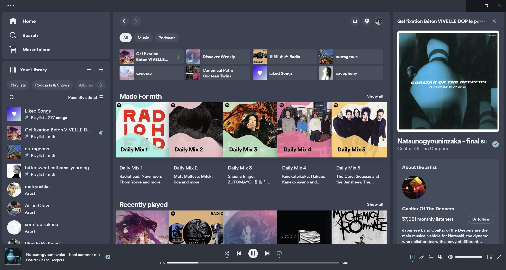

<p align="center">
  <a href="https://www.nordtheme.com" target="_blank">
    <picture>
      <source srcset="https://raw.githubusercontent.com/nordtheme/assets/main/static/images/logos/heroes/logo-typography/dark/frostic/nord3/spaced.svg?sanitize=true" width="100%" media="(prefers-color-scheme: light), (prefers-color-scheme: no-preference)" />
      <source srcset="https://raw.githubusercontent.com/nordtheme/assets/main/static/images/logos/heroes/logo-typography/light/frostic/nord6/spaced.svg?sanitize=true" width="100%" media="(prefers-color-scheme: dark)" />
      
    </picture>
  </a>
</p>

<h3 align="center">
	Nord theme for <a href="https://github.com/spicetify/spicetify-cli">Spicetify</a>
	
</h3>


## Previews



## Usage

**Manual installation** 

1. Follow the installation instructions for [Spicetify](https://spicetify.app/docs/getting-started)
   * Note: The installation instructions for linux have you setting `/opt/spotify` and `/opt/spotify/Apps/*` permissions to `777`. This is not good practice and should be avoided. If you want, you can set the group ownership for these paths to one that your user is apart of (i.e. `users`), or you can create a new group and add it as a secondary group to your user. After that you can use the following command to give access to the group:
      ```
      GROUP=<group_name>
      sudo chgrp $GROUP /opt/spotify
      sudo chgrp -R $GROUP /opt/spotify/Apps
      sudo chmod 775 /opt/spotify
      sudo chmod 775 -R /opt/spotify/Apps
      ```

2. Follow the [installation and basic usage guide](https://spicetify.app/docs/getting-started) to setup Spicetify

3. Clone/Download the repository, and place the `nordic` folder (containing `user.css`, `theme.js`, `color.ini`, and `assets`) in the `Spicetify/Themes` directory:
      ```
      # UNIX
      cp -r nordic ~/.config/spicetify/Themes/
      
      # Windows
      cp nordic "$(spicetify -c | Split-Path)\Themes\" -Recurse
      ```

4. Set theme and color scheme. Supported color schemes: `dark` (light theme to be added later):
   ```
   spicetify config current_theme nordic
   spicetify config color_scheme dark
   spicetify config inject_css 1 inject_theme_js 1 replace_colors 1 overwrite_assets 1
   spicetify apply
   ```
5. To set an accent color, head over to Spotify's settings page and select the accent colour. 

## 📜 License

This is a fork of [Catppuccin](https://github.com/catppuccin/spicetify?tab=readme-ov-file), which is released under the MIT license, which grants the following permissions:

-   Commercial use
-   Distribution
-   Modification
-   Private use

For more convoluted language, see the [LICENSE](https://github.com/catppuccin/catppuccin/blob/main/LICENSE).

## 💝 Thanks to Catppuccin's team

Creator:
- [davidbgonz](https://github.com/davidbgonz)

Maintainers:
- (Style) - [OlaoluwaM](https://github.com/OlaoluwaM)
- (Style) - [ghostx31](https://github.com/ghostx31)
- (Style/Extension) - [OhItsTom](https://github.com/ohitstom)

<p align="center"></p>
<p align="center">Copyright &copy; 2022-present <a href="https://github.com/catppuccin" target="_blank">Catppuccin Org</a>
<p align="center"><a href="https://github.com/catppuccin/catppuccin/blob/main/LICENSE"></a></p>
